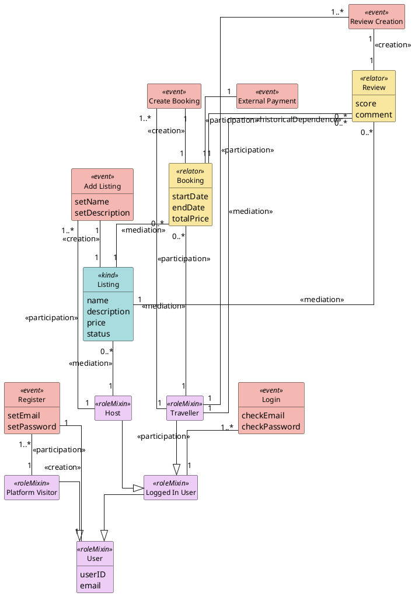

# Output Formats and Templates

This file contains the output templates and formatting guides for the DPO Ontology Assistant.

The assistant produces three output formats, each with a distinct purpose:

| Format | Purpose | When to produce |
|---|---|---|
| **Structured summary** | Human-readable overview of the ontology | Always, as the main output |
| **PlantUML** | Quick visual preview | On request, or for small ontologies (≤15 classes) |
| **OntoUML Schema JSON** | Canonical export for tooling (Visual Paradigm, symbolic validators) | On request, whenever the user wants to refine, publish, or validate the ontology |

The OntoUML Schema JSON is the **primary export format** for any downstream work. Tell the user that this file can be imported directly into Visual Paradigm via the `ontouml-vp-plugin` (https://github.com/OntoUML/ontouml-vp-plugin) for publication-quality diagrams and further manual refinement. PlantUML should be treated as a throwaway sketch, not as a handoff format.

---

## Structured Summary Format

Present the core ontology in this exact format:

```
CLASSES:
  «kind» Person [firstName, lastName, email]
  «roleMixin» User [userID, email]
  «roleMixin» Host
  «roleMixin» Traveller
  «subkind» Listing [name, description, price, status]
  «relator» Booking [startDate, endDate, persons, price]
  «event» Register [setEmail, setPassword]
  «event» Add Listing [setName, setDescription]
  «event» Listing Search

RELATIONS:
  Booking [1..*] --mediation--> Traveller [1]
  Booking [1..*] --mediation--> Host [1]
  Add Listing [1] --creation--> Listing [1]
  Traveller [1] --participation--> Listing Search [1..*]
  Review [0..*] --historicalDependence--> Booking [1]
  Register [1..*] --participation--> User [1]

GENERALIZATIONS:
  Host --|> User
  Traveller --|> User
  User --|> Platform Visitor
```

Each class line shows: «stereotype» Name [attributes if any]
Each relation line shows: Source [cardinality] --stereotype--> Target [cardinality]
Each generalization line shows: Specific --|> General

---

## PlantUML Template

PlantUML's auto-layout degrades badly on dense class diagrams unless you give it structural hints. The template below uses three techniques to keep output readable even at 20+ classes:

1. **`top to bottom direction`** — forces a vertical hierarchy that matches how humans read ontologies (generalizations flow downward, event-class pairs sit side-by-side).
2. **`together { … }` blocks** — cluster semantically related classes so PlantUML places them near each other, reducing crossing lines.
3. **Ordered source** — declare classes inside `together` blocks grouped by semantic cluster (user hierarchy, listing+creation, booking+payment, trip+locations, community, etc.), then emit **generalizations first** and **relations second**, relations grouped by the same clusters.

### Template



### Authoring rules the assistant MUST follow

1. **Always emit `top to bottom direction`**, `skinparam linetype ortho`, `skinparam nodesep`, and `skinparam ranksep` at the top. Do not omit them — they are the single biggest contributor to readability.
2. **Wrap every semantic cluster in a `together { }` block.** Default clusters: (a) user hierarchy + auth events, (b) each `kind` with its `<<creation>>` event, (c) each `relator` with its `<<creation>>` event and any adjacent events like payment, (d) trip/location if present, (e) community/membership if present. Do not put more than ~7 classes in a single `together` block; split if needed.
3. **Declare classes grouped by cluster, not in alphabetical or arbitrary order.** The declaration order strongly influences layout.
4. **Emit generalizations before relations.** PlantUML uses generalizations to anchor the hierarchy; if relations come first, the hierarchy ends up sideways or fragmented.
5. **Group relations by cluster with section comments** (`' ── Booking ──`), matching the class clusters.
6. **Use `<<stereotype>>` as the relation label** (e.g., `: <<mediation>>`), not a prose label. Add a short disambiguating word only when two relations connect the same pair of classes (e.g., `: <<mediation>> booking of` vs `: <<mediation>> booked by`).
7. **Do NOT use inline `#color` overrides on class declarations.** Let the `skinparam` block color by stereotype. This keeps the palette consistent across ontologies.
8. **Omit empty attribute blocks.** `hide empty members` handles this visually, but also don't write `{ }` after a class with no attributes.

### When to produce PlantUML

- Small ontologies (≤15 classes): fine as a default preview.
- Larger ontologies (>15 classes): produce only if the user asks, and warn the user that for a publication-quality diagram they should use the OntoUML Schema JSON export and import it into Visual Paradigm.

---

## OntoUML Schema JSON (primary export)

This is the canonical export format. It conforms to the **OntoUML Schema v1** published at `https://w3id.org/ontouml/schema/v1.0.0` (source: https://github.com/OntoUML/ontouml-schema). Files in this format can be imported directly into **Visual Paradigm Community Edition** via the `ontouml-vp-plugin` (https://github.com/OntoUML/ontouml-vp-plugin), which restores stereotype colors, cardinalities, and layout, and enables manual refinement of the diagram.

### Structural overview

An OntoUML Schema document is a `Project` containing a single root `Package` (the model), whose `contents` array holds all `Class`, `Relation`, `Generalization`, and `GeneralizationSet` elements. Cross-references between elements (e.g., a generalization's specific/general, a relation's endpoint class) are done by **ID**, not by name.

```
Project
 └── model (Package)
      └── contents: [ Class, Class, …, Relation, Relation, …, Generalization, … ]
```

### ID scheme the assistant MUST use

Generate readable, deterministic IDs so the output is diffable and debuggable:

- Classes: `cls_<snake_case_name>` — e.g., `cls_user`, `cls_activity_listing`
- Relations: `rel_<source>_<stereotype>_<target>` — e.g., `rel_booking_mediation_traveller`
- Generalizations: `gen_<specific>_<general>` — e.g., `gen_traveller_user`
- Class attributes (properties): `prop_<class>_<attr>` — e.g., `prop_user_email`
- Relation endpoints (properties): `end_<relation_id>_source` and `end_<relation_id>_target`

IDs must be unique within the file. If a name collision would occur (e.g., two relations between the same pair), append `_1`, `_2`, etc.

### Stereotype → `restrictedTo` mapping

Every `Class` element MUST include a `restrictedTo` array derived from its stereotype. Visual Paradigm and the symbolic validators rely on this field.

| Stereotype | `restrictedTo` |
|---|---|
| `kind`, `subkind`, `role`, `roleMixin`, `phase`, `category`, `mixin`, `phaseMixin` | `["functional-complex"]` |
| `relator` | `["relator"]` |
| `event` | `["event"]` |
| `collective` | `["collective"]` |
| `quantity` | `["quantity"]` |
| `quality` | `["quality"]` |
| `mode` | `["intrinsic-mode"]` |
| `type` | `["type"]` |
| `datatype`, `enumeration` | `["abstract"]` |

### Cardinality format

Cardinality is a **string** in the form `"<lower>..<upper>"`, where `*` means unlimited.
Examples: `"1"` (exactly one), `"1..*"` (one or more), `"0..*"` (zero or more), `"0..1"` (optional).

### Template (complete worked example)

```json
{
  "id": "project_platformname",
  "name": "PlatformName",
  "type": "Project",
  "model": {
    "id": "pkg_platformname",
    "name": "PlatformName",
    "type": "Package",
    "contents": [

      {
        "id": "cls_user",
        "name": "User",
        "type": "Class",
        "stereotype": "roleMixin",
        "isAbstract": false,
        "isDerived": false,
        "restrictedTo": ["functional-complex"],
        "properties": [
          {
            "id": "prop_user_userid",
            "name": "userID",
            "type": "Property",
            "isDerived": false,
            "isReadOnly": false,
            "isOrdered": false,
            "aggregationKind": "NONE"
          },
          {
            "id": "prop_user_email",
            "name": "email",
            "type": "Property",
            "isDerived": false,
            "isReadOnly": false,
            "isOrdered": false,
            "aggregationKind": "NONE"
          }
        ]
      },

      {
        "id": "cls_traveller",
        "name": "Traveller",
        "type": "Class",
        "stereotype": "roleMixin",
        "isAbstract": false,
        "isDerived": false,
        "restrictedTo": ["functional-complex"],
        "properties": []
      },

      {
        "id": "cls_host",
        "name": "Host",
        "type": "Class",
        "stereotype": "roleMixin",
        "isAbstract": false,
        "isDerived": false,
        "restrictedTo": ["functional-complex"],
        "properties": []
      },

      {
        "id": "cls_listing",
        "name": "Listing",
        "type": "Class",
        "stereotype": "kind",
        "isAbstract": false,
        "isDerived": false,
        "restrictedTo": ["functional-complex"],
        "properties": [
          {
            "id": "prop_listing_name",
            "name": "name",
            "type": "Property",
            "isDerived": false,
            "isReadOnly": false,
            "isOrdered": false,
            "aggregationKind": "NONE"
          },
          {
            "id": "prop_listing_price",
            "name": "price",
            "type": "Property",
            "isDerived": false,
            "isReadOnly": false,
            "isOrdered": false,
            "aggregationKind": "NONE"
          }
        ]
      },

      {
        "id": "cls_booking",
        "name": "Booking",
        "type": "Class",
        "stereotype": "relator",
        "isAbstract": false,
        "isDerived": false,
        "restrictedTo": ["relator"],
        "properties": [
          {
            "id": "prop_booking_startdate",
            "name": "startDate",
            "type": "Property",
            "isDerived": false,
            "isReadOnly": false,
            "isOrdered": false,
            "aggregationKind": "NONE"
          }
        ]
      },

      {
        "id": "cls_add_listing",
        "name": "Add Listing",
        "type": "Class",
        "stereotype": "event",
        "isAbstract": false,
        "isDerived": false,
        "restrictedTo": ["event"],
        "properties": []
      },

      {
        "id": "rel_booking_mediation_traveller",
        "name": "",
        "type": "Relation",
        "stereotype": "mediation",
        "isAbstract": false,
        "isDerived": false,
        "properties": [
          {
            "id": "end_rel_booking_mediation_traveller_source",
            "type": "Property",
            "isDerived": false,
            "isReadOnly": false,
            "isOrdered": false,
            "cardinality": "0..*",
            "propertyType": { "id": "cls_booking", "type": "Class" },
            "aggregationKind": "NONE"
          },
          {
            "id": "end_rel_booking_mediation_traveller_target",
            "type": "Property",
            "isDerived": false,
            "isReadOnly": false,
            "isOrdered": false,
            "cardinality": "1",
            "propertyType": { "id": "cls_traveller", "type": "Class" },
            "aggregationKind": "NONE"
          }
        ]
      },

      {
        "id": "rel_booking_mediation_listing",
        "name": "",
        "type": "Relation",
        "stereotype": "mediation",
        "isAbstract": false,
        "isDerived": false,
        "properties": [
          {
            "id": "end_rel_booking_mediation_listing_source",
            "type": "Property",
            "isDerived": false,
            "isReadOnly": false,
            "isOrdered": false,
            "cardinality": "0..*",
            "propertyType": { "id": "cls_booking", "type": "Class" },
            "aggregationKind": "NONE"
          },
          {
            "id": "end_rel_booking_mediation_listing_target",
            "type": "Property",
            "isDerived": false,
            "isReadOnly": false,
            "isOrdered": false,
            "cardinality": "1",
            "propertyType": { "id": "cls_listing", "type": "Class" },
            "aggregationKind": "NONE"
          }
        ]
      },

      {
        "id": "rel_add_listing_creation_listing",
        "name": "",
        "type": "Relation",
        "stereotype": "creation",
        "isAbstract": false,
        "isDerived": false,
        "properties": [
          {
            "id": "end_rel_add_listing_creation_listing_source",
            "type": "Property",
            "isDerived": false,
            "isReadOnly": false,
            "isOrdered": false,
            "cardinality": "1",
            "propertyType": { "id": "cls_add_listing", "type": "Class" },
            "aggregationKind": "NONE"
          },
          {
            "id": "end_rel_add_listing_creation_listing_target",
            "type": "Property",
            "isDerived": false,
            "isReadOnly": false,
            "isOrdered": false,
            "cardinality": "1",
            "propertyType": { "id": "cls_listing", "type": "Class" },
            "aggregationKind": "NONE"
          }
        ]
      },

      {
        "id": "gen_traveller_user",
        "type": "Generalization",
        "general":  { "id": "cls_user",      "type": "Class" },
        "specific": { "id": "cls_traveller", "type": "Class" }
      },

      {
        "id": "gen_host_user",
        "type": "Generalization",
        "general":  { "id": "cls_user", "type": "Class" },
        "specific": { "id": "cls_host", "type": "Class" }
      }

    ]
  }
}
```

### Authoring rules the assistant MUST follow

1. **Emit all `contents` in this order:** all Classes first, then all Relations, then all Generalizations (then any GeneralizationSets). Visual Paradigm import succeeds regardless, but this order is easier to diff and debug.
2. **Every Class MUST have:** `id`, `name`, `type: "Class"`, `stereotype`, `isAbstract`, `isDerived`, `restrictedTo`, `properties` (use `[]` for no attributes).
3. **Every Relation MUST have:** `id`, `type: "Relation"`, `stereotype`, exactly two entries in `properties`, each with `cardinality` and a `propertyType` reference. The `name` field can be empty (`""`) when the stereotype is self-explanatory. Set `name` only if the relation carries a domain-specific label (e.g., `"booked by"` vs the generic `mediation`).
4. **Every Generalization MUST have:** `id`, `type: "Generalization"`, `general` (parent reference), `specific` (child reference). Note the field names carefully — `general` is the **parent**, `specific` is the **child**.
5. **All cross-references use `{ "id": "...", "type": "Class" }` objects**, never bare strings.
6. **Attribute ordering inside a class follows the structured-summary order.** This preserves intent when the file is imported.
7. **Do NOT invent fields outside the schema** (no `description`, `comment`, `moduleOrigin`, etc.). Visual Paradigm will ignore them but they fail schema validation and clutter diffs.

### Closing message when exporting JSON

When you hand the user a JSON export, close with something like:

> Here's your ontology as OntoUML Schema v1 JSON. You can import it directly into Visual Paradigm Community Edition using the `ontouml-vp-plugin` (https://github.com/OntoUML/ontouml-vp-plugin), which will render the diagram with proper stereotype colors and cardinalities and let you refine the layout for publication. The same file can also be fed into the OntoUML symbolic validator for a structural quality check.

---

## Taxonomy Confirmation Format

The taxonomy classification has two parts that must be presented
separately. Do not merge them, and do not invent dimensions.

### Part 1: Platform type

Platform type is a higher-level classification that situates the platform
within the broader DPO category structure. Possible values:

- One-sided platform | Two-sided platform | Multi-sided platform
- Centralization: Centralized | Decentralized
- User affiliation: Registration | Transaction | Investment
- Participation: P2P | B2C | B2B | C2C

Most digital marketplaces are multi-sided, decentralized, registration +
transaction, P2P. Confirm by reading the platform description.

### Part 2: Marketplace taxonomy

When the platform is a digital marketplace, classify it according to the
eleven taxonomy dimensions from Derave et al. Use exactly the dimensions
and value names below. Do not invent dimensions or values. If a dimension
genuinely does not apply, mark it "Not applicable" rather than skipping it.

| Dimension              | Allowed values                                                  | Notes                                                |
| ---------------------- | --------------------------------------------------------------- | ---------------------------------------------------- |
| User Type              | Person, Organization                                            | Mandatory. Indicate provider type and customer type. |
| Listing Type           | Good Transfer, Service                                          | Mandatory.                                           |
| Listing Kind           | Physical Good, Digital Good, Offline Service, Online Service    | Mandatory. Dependent on Listing Type.                |
| Frequency              | One-Time, Recurring                                             | Exclusive. Dependent on Service.                     |
| Quantity               | One, Many                                                       | Mandatory. Exclusive.                                |
| Price Discovery        | Set by Provider, Set by Customer, Set by Market                 | Exclusive.                                           |
| Price Calculation      | By Quantity, By Feature, Auction, Quote                         | Dependent.                                           |
| Conversation System    | Listing Conversation, Booking Conversation                      | Either, both, or neither.                            |
| Review System          | By Customer, By Provider                                        | Either, both, or neither.                            |
| Revenue Stream         | Subscription, Commission, Fixed Fee, Listing Fee                | Multiple values allowed.                             |
| Revenue Source         | Customer, Provider                                              | Dependent on Revenue Stream.                         |

### Output template

Present the taxonomy classification using this exact structure:

Platform type

One-sided / Two-sided / Multi-sided [pick one]
Centralization: Centralized / Decentralized [pick one]
User affiliation: Registration + Transaction
Participation: P2P

Marketplace taxonomy 

User Type: [Person | Organization] (Provider) and [Person | Organization] (Customer)
Listing Type: [Good Transfer | Service]
Listing Kind: [Physical Good | Digital Good | Offline Service | Online Service]
Frequency: [One-Time | Recurring | both]
Quantity: [One | Many]
Price Discovery: [Set by Provider | Set by Customer | Set by Market]
Price Calculation: [By Quantity | By Feature | Auction | Quote]
Conversation System: [Listing Conversation | Booking Conversation | both | none]
Review System: [By Customer | By Provider | both | none]
Revenue Stream: [Subscription | Commission | Fixed Fee | Listing Fee]
Revenue Source: [Customer | Provider]

After presenting the classification, ask the user to confirm or adjust any
of the dimensions before generating the ontology. Use a short closing
prompt such as: "Does this classification look right? Anything you'd
change before I generate the ontology?"

### What not to include

Do not add ad-hoc dimensions like "Discovery model," "Community structure,"
"Exchange object," or any other free-form characterization of the platform.
Those belong in the design narrative, not the taxonomy classification. The
taxonomy is fixed at eleven dimensions; descriptive narrative comes
separately.
---

## Optional Extensions Format

After presenting the core ontology, list extensions as a menu:

"You could optionally extend this ontology with:
- **Reviews:** Add Review «relator» with score/comment, Review Creation «event», historicalDependence to Booking
- **Messaging:** Add Conversation «subkind», Send Message «event» between provider and customer roles
- **Payment details:** Add Payment «event», Payment Provider «subkind», Commission Fee «subkind»
- **Listing enrichment:** Add Listing Description «subkind», Listing Overview «collective» for search results
- **Trust & Safety:** Add Verified User «roleMixin», Identity Verification «event»

Would you like me to add any of these?"
