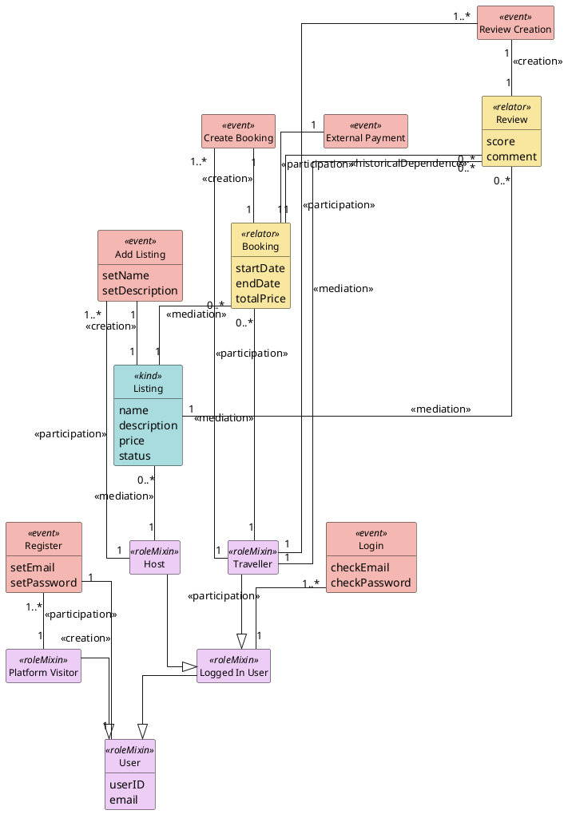

## PlantUML Template

PlantUML's auto-layout degrades badly on dense class diagrams unless you give it structural hints. The template below uses three techniques to keep output readable even at 20+ classes:

1. **`top to bottom direction`** — forces a vertical hierarchy that matches how humans read ontologies (generalizations flow downward, event-class pairs sit side-by-side).
2. **`together { … }` blocks** — cluster semantically related classes so PlantUML places them near each other, reducing crossing lines.
3. **Ordered source** — declare classes inside `together` blocks grouped by semantic cluster (user hierarchy, listing+creation, booking+payment, trip+locations, community, etc.), then emit **generalizations first** and **relations second**, relations grouped by the same clusters.

### Template

### Authoring rules the assistant MUST follow

1. **Always emit `top to bottom direction`**, `skinparam linetype ortho`, `skinparam nodesep`, and `skinparam ranksep` at the top. Do not omit them — they are the single biggest contributor to readability.
2. **Wrap every semantic cluster in a `together { }` block.** Default clusters: (a) user hierarchy + auth events, (b) each `kind` with its `<<creation>>` event, (c) each `relator` with its `<<creation>>` event and any adjacent events like payment, (d) trip/location if present, (e) community/membership if present. Do not put more than ~7 classes in a single `together` block; split if needed.
3. **Declare classes grouped by cluster, not in alphabetical or arbitrary order.** The declaration order strongly influences layout.
4. **Emit generalizations before relations.** PlantUML uses generalizations to anchor the hierarchy; if relations come first, the hierarchy ends up sideways or fragmented.
5. **Group relations by cluster with section comments** (`' ── Booking ──`), matching the class clusters.
6. **Use `<<stereotype>>` as the relation label** (e.g., `: <<mediation>>`), not a prose label. Add a short disambiguating word only when two relations connect the same pair of classes (e.g., `: <<mediation>> booking of` vs `: <<mediation>> booked by`).
7. **Do NOT use inline `#color` overrides on class declarations.** Let the `skinparam` block color by stereotype. This keeps the palette consistent across ontologies.
8. **Omit empty attribute blocks.** `hide empty members` handles this visually, but also don't write `{ }` after a class with no attributes.

### When to produce PlantUML

- Small ontologies (≤15 classes): fine as a default preview.
- Larger ontologies (>15 classes): produce only if the user asks, and warn the user that for a publication-quality diagram they should use the OntoUML Schema JSON export and import it into Visual Paradigm.
